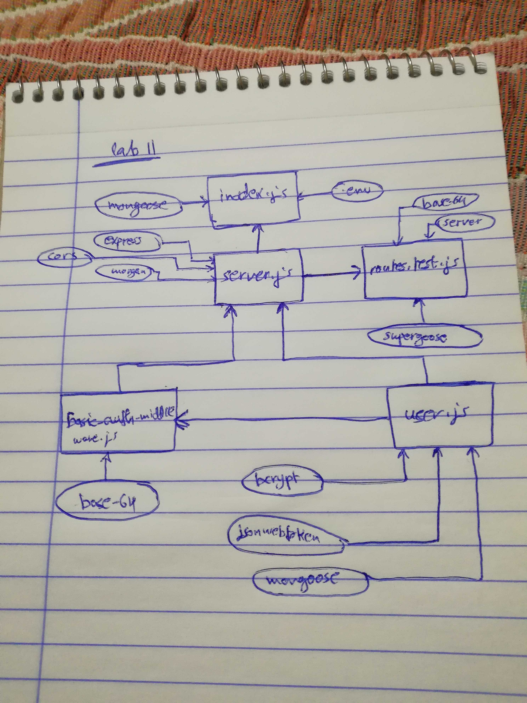

# LAB - Class 14

### Author: Ayman Alkhawaldeh

### Links and Resources

- [submission PR]()

### Setup
npm i jest eslint

#### How to initialize/run your application (where applicable)

- `npm test`

#### Tests

- How do you run tests?
     - 'npm test'
- Any tests of note?
     - jest --verbose --coverage
- Describe any tests that you did not complete, skipped, etc
     - evey test solved and another time i will cover more cases.
### My-app-data
- CLIENT_ID=bb4c99764a7fd93dc205
- CLIENT_SECRET=1bdb6151f8e226bac4d82c71d8887dc421473ee5
### Groub name : Qusai-alhanaktah, Mohmmad-Alhawamdeh, Ayman-Alkwaldeh, Ahmad-Al-Mhasnah
#### UML
Link to an image of the UML for your application and response to events
